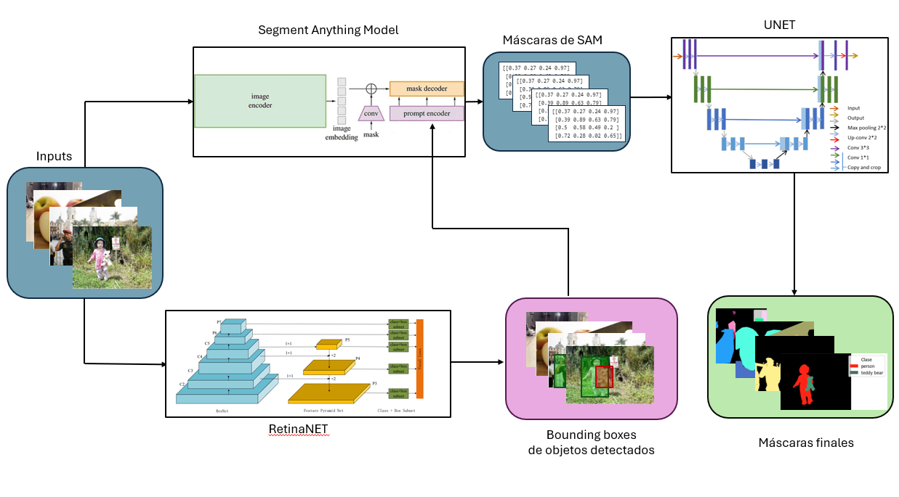

# Segmentación semántica del dataset COCO mediante U-Net y arquitecturas ensemble 

A lo largo de este proyecto se aborda mediante diferentes aporximaciones el proceso completo de la resolución de un problema de **segmentación semántica** mediante diferentes arquitecturas tanto convolucionales más simples como con arquitecturas ensemble complejas conformadas por modelos fundacionales. Además, para la productivización de los diferentes modelos se incluye un aplicativo web que permite su uso de forma intuitiva y práctica para el usuario final.
El trabajo se ha estructurado siguiendo la metodología `CRISP-DM`, organizada de la siguiente manera:

### 1. *Business Understanding* y *Data Understanding* 📊 
Abarcam tanto el entendimeinto del objetivo del proyecto como la carga y evaluación del conjunto de datos, con el objetivo de la detección de patrones que influirán en fases posteriores de la metodología. Con estas fases se busca la detección de insights que resulten en los mejores resultados posibles que se adecuen de forma óptima al problema definido.

- La comprensión del negocio y la carga de datos se desarrollan en el notebook  [`src/01_data_loading.ipynb`](src/01_data_loading.ipynb).
- El análisis exploratorio del conjunto de datos tiene lugar en el notebook [`src/02_exploratory_data_analysis.ipynb`](src/02_exploratory_data_analysis.ipynb).

### 2. *Data Preparation* 🛠️  
Fase que abarca la conversión y limpieza de las imágenes en un formato común (filtrado de clases, homogeneización de las dimentiones, casting a un formato común, en este caso `tf.tfrecord`, cambios en sus características, etc.) que permitan la obtención de los mejores resultados posibles en el entrenamiento de los modelos. Además, en esta se incluye la definición de la fase de data augmentation, usada para el entrenamieto de los modelos.

El contenido de esta fase se desarrolla en el notebook [`src/03_data_preprocessing.ipynb`](src/03_data_preprocessing.ipynb).

### 3. *Modeling* 🤖 
Fase que comprende el entrenamiento de modelos que permitirán resolver el problema. Las arquitecturas propuestas han sido:
1) Modelo baseline, en este caso la U-Net: contenido en el notebook [`src/04_01_data_modeling_UNET.ipynb`](src/04_01_data_modeling_UNET.ipynb).
2) Arquitectura ensemble con YoloV8 + SAM: implementada en el notebook [`src/04_02_data_modeling_YOLO_SAM.ipynb`](src/04_02_data_modeling_YOLO_SAM.ipynb).
3) Arquitectura ensemble con Retinanet + SAM: desarrollada en [`src/04_03_data_modeling_RetinaNet_SAM.ipynb`](src/04_03_data_modeling_RetinaNet_SAM.ipynb).
4) Arquitectura ensemble inversa con SAM + CLIP: contenida en el notebook [`src/04_04_data_modeling_SAM_CLIP.ipynb`](src/04_04_data_modeling_SAM_CLIP.ipynb).
5) Arquitectura ensemble final usando Retinanet + SAM + U-Net: desarrollada en el notebook [`src\04_05_data_modeling_final_model.ipynb`](src\04_05_data_modeling_final_model.ipynb).

La arquitectura de este modelo final es la de la imagen siguiente:

### 4. *Evaluation* 📈 

Se comparan los resultados obtenidos por cada uno de los modelos desarrollados atendiendo a diferentes criterios que evaluen de forma efectiva el funcionamiento de los modelos.
Esta comparativa de resultados tiene lugar en el fichero [`src/05_results_comparative.ipynb`](src/results_comparative.ipynb).

### 5. *Deployment*🚀 

Fase que comprende el desarrollo de un servicio web en en framework de Python `Dash` y la definición de las pipelines completas de los modelos para productivizar los modelos desarrollados en un formato web intuitivo.

Esta puede ser encontrada en el directorio [`src/06_deployment/src/app.py`](src/06_deployment/src/app.py).
Una guia detallada con todos los elementos para el despliegue puede encontrarse en el siguiente enlace [https://github.com/rucasca/deployment_stacking_ensemble_segmentation_model](https://github.com/rucasca/deployment_stacking_ensemble_segmentation_model)

### *Reproducción de los experimentos* 🔬

Para la reproducción de los expermientos realizados se facilita un fichero `pyproject.toml` que contiene todas las librerias empleadas y sus versiones correspondientes.
Para su instalación, se han de seguir los pasos siguientes: 
1) Instalación de poetry mediante el *pip*
2) Ejecución del comando por consola `poetry install`
3) Ejecución de los notebook. En el caso de que VSCode no seleccione el entorno creado de forma automática, selección manual del mismo mediante `CTRL + SHIT + P` -> Select Python interpreter
4) Rellenado de las variables del entorno del fichero `.env` con las direcciones de memoria en locar que apunten a los pesos de los modelos fundacionales descargados desde sus respectivos enlaces.
5) Para el despliegie de la web, ejecutar el fichero [`src/deployment/src/app.py`](src/deployment/src/app.py)

